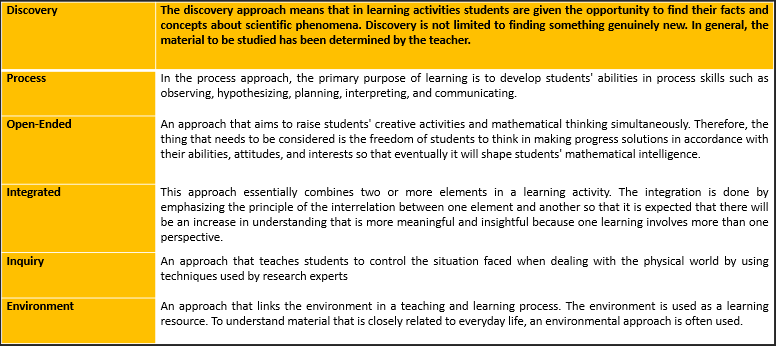
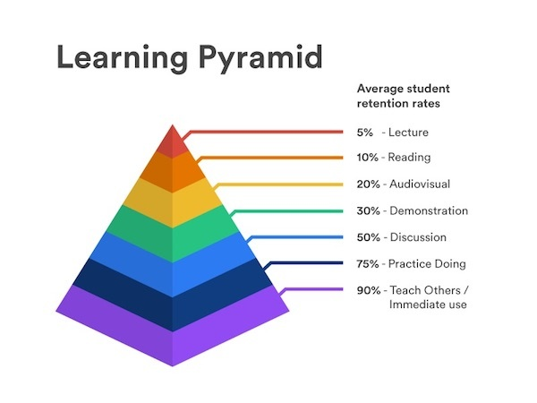

```{r setup, include=FALSE}
knitr::opts_chunk$set(
  message = FALSE,
  warning = FALSE,
  fig.asp = 0.75,
  fig.align = "center",
  out.width = "100%",
  collapse = TRUE,
  comment = "#>"
)

library(tidyverse)
library(plotly)
library(stringi)
```

# Background


## Students Functionality Needs
+ **Learning to know** (it is intended that students discover and master knowledge seeking skills that will serve them)
+ **Learning to do** (the challenge facing education today is to find methods that will succeed in transforming school knowledge into practical competence)
+ **Learning to live together** (it means of facing the challenges presented by the social, economic and political globalization of the world, and requires that citizens can understand that their actions will have far-reaching effects on those around them).

## Students Usability Needs
+ **Learning to be** (provide opportunities in which students can express themselves and their beliefs and viewpoints, both)
+ **Learning to learn** (seeing learning in its own right as a process from which pleasure, satisfaction, motivation, and empowerment at an individual/personal level can be derived). 

## Students Pleasurable Needs
+ **The students' psychological needs**, i.e., perceptual and emotional experiences also need to be fulfilled (Sharma   et al. 2013). In the educational field, the pleasurability needs help student to enjoy the teaching presented by the instructor.    
+ **Understand and share multicultural issues** by the pedagogical theory (teaching approach, teaching method, evaluation method, and tools) of ‘diversity,' which will enlarge the   learning style, cognitive style, personality type, mental and virtual boundaries of schools, teachers, and students
+ **Develop methods and tools** that can generate and foster the ‘pleasure’ of learning.

# Learning Model Scheme
## 

# Pedagogical Theory

## Learning Model   
Learning model is a plan or pattern that can be used to form long-term lesson plans, design and guide learning in the classroom (Rusman 2010).   

- **Learning Approach** (Student or teacher centered)   
- **Learning Strategy** (Exposition-discovery learning or group-individual learning)   
- **Learning Methods** (Lecture, discussion, simulation, etc)   
- **Learning Techniques and Tactics** (Specific, individual, unique) 

## 

## Learning Approach

## 

## Learning Strategies
Learning strategies refer to Students' self-generated thoughts, feelings, and actions, which are systematically oriented toward attainment of their goals. (Hasanbegovic, Jasmina 2006)

## Learning Method
The method of teaching is a knowledge of teaching methods used by a teacher or instructor. One effort that the teacher has never opened is a way of overcoming the position of the method as one component that takes part in supporting teaching and learning activities.

## 

# Learning Pyramid

## 

# Student Centered Approach

- **Choice**
We're wired for free will

- **Collaboration**
We're wired to be social creatures

- Communication

- Critical Thinking
Problem Solving

- Creativity
A unique human pleasure

- Caring

# How to get student's attention

## Register
A particular part of the range of a voice or instrument.

## Timbre
The character or quality of a musical sound or voice as distinct from its pitch and intensity.

## Prosody
The patterns of stress and intonation in a language

## Pace
A unit of length representing the distance between two successive steps
	 
## Pitch
The quality of a sound governed by the rate of vibrations producing it; the degree of highness or lowness of a tone
	 
## Volume
Quantity or power of sound; degree of loudness

# Conclusion
  
## There is no most effective learning model for all subjects or for all material. 

## The selection of learning models to be applied by teachers in the classroom considers several things:
+ learning objectives
+ nature of the subject matter 
+ availability of facilities 
+ conditions of students 
+ time allocation available

# Thank You
